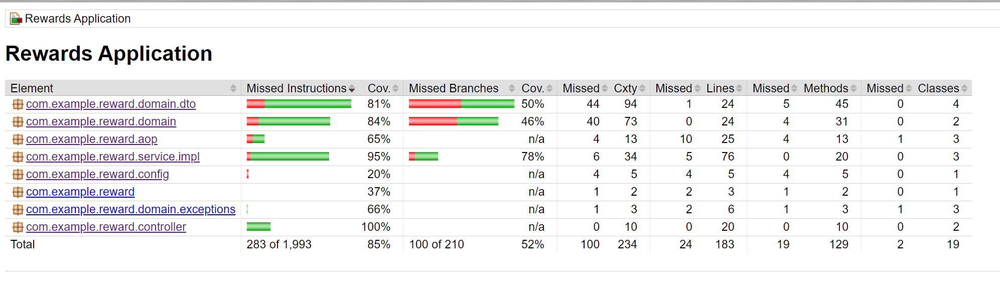

# Rewards Application
A shopping reward application that calculate the earned awarding points based on the purchased order.

## 1. Getting Started

1. Start the application located in the `com.example.reward.RewardsApplication`.


2. Open the H2 DB and log in the [Database Console](http://localhost:8080/database) with the following credentials.

```
database url: jdbc:h2:mem:testdb
username: 123
password: 123
```
3. Import [Postman Configuration](file/postman.json) to test the API Endpoints based on the API Documentation.

## 2. API Endpoints

please visit the following link to see the [API Documentation](http://localhost:8080/swagger-ui.html).

## 3. Test

Unit tests, Integration tests are included with a 86% JaCoCo test coverage.


<div align="center">
  
</div>


## 4. Insert Test Data

You can generate the test data by send a predefined request in the postman collection, you can also have your own test data by sending a POST request to `http://localhost:8080/transaction/create/many` to generate many transactions records based on API Documentation.

Here is an example of the request body to generate test data:
```json
[
    {
        "userId": 1,
        "amount": 80,
        "issuedDate": "2024-01-11 22:12:15"
    },
    {
        "userId": 1,
        "amount": 120,
        "issuedDate": "2024-02-11 22:12:15"
    },
    {
        "userId": 1,
        "amount": 200,
        "issuedDate": "2024-03-11 22:12:15"
    },
    {
        "userId": 2,
        "amount": 150,
        "issuedDate": "2024-02-11 22:12:15"
    },
    {
        "userId": 3,
        "amount": 150,
        "issuedDate": "2024-01-11 22:12:15"
    }
]
```
And corresponding user Summary Response:
```json
{
    "timestamp": "2024-04-11T14:55:51.386Z",
    "messageType": "Success",
    "message": [
        {
            "userId": 1,
            "totalPoints": 370,
            "lastMonthPoints": 250,
            "twoMonthsAgoPoints": 90,
            "threeMonthsAgoPoints": 30
        },
        {
            "userId": 2,
            "totalPoints": 150,
            "lastMonthPoints": 0,
            "twoMonthsAgoPoints": 150,
            "threeMonthsAgoPoints": 0
        },
        {
            "userId": 3,
            "totalPoints": 150,
            "lastMonthPoints": 0,
            "twoMonthsAgoPoints": 0,
            "threeMonthsAgoPoints": 150
        }
    ]
}
```


